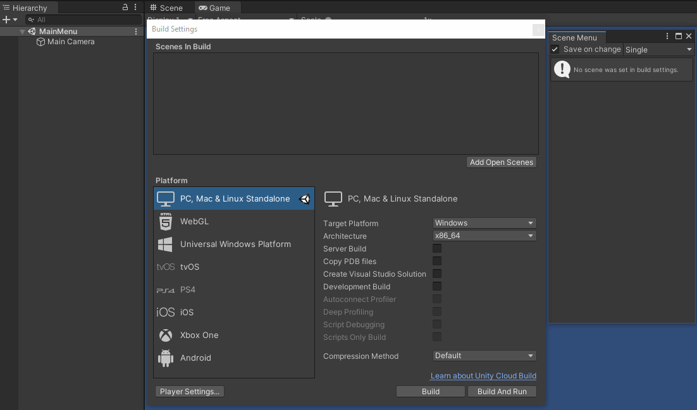
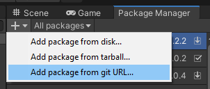

# Scene Menu Window

This is a plugins for Unity Editor that will show all your scene that active in build settings and easily to open scene or open by additive.
Created by Thanut Panichyotai (@[LuviKunG]((https://github.com/LuviKunG)))

## How to use?

You can open scene menu window by select **Window/LuviKunG/Scene Menu** in Unity menu bar.



- Toolbars
  - **Save on change** If enable, will save current active scene (or ask when new scene) before open another scene.
  - **Dropdown Menu** Select mode how to open new scene.

## How to install?

### UPM Install via manifest.json

Locate to your Unity Project. In *Packages* folder, you will see a file named **manifest.json**. Open it with your text editor (such as Notepad++ or Visual Studio Code or Legacy Notepad)

Then merge this json format below.

(Do not just copy & paste the whole json! If you are not capable to merge json, please using online JSON merge tools like [this](https://tools.knowledgewalls.com/onlinejsonmerger))

```json
{
  "dependencies": {
    "com.luvikung.scenemenuwindow": "https://github.com/LuviKunG/SceneMenuWindow.git#1.0.0"
  }
}
```

If you want to install the older version, please take a look at release tag in this git, then change the path after **#** to the version tag that you want.

### Unity 2019.3 Git URL

In Unity 2019.3 or greater, Package Manager is include the new feature that able to install the package via Git.



Just simply using this git URL and following with version like this example.

**https://github.com/LuviKunG/SceneMenuWindow.git#1.0.0**

Make sure that you're select the latest version.

### Unity UPM Git Extension (For 2019.2 and older version)

If you doesn't have this package before, please redirect to this git [https://github.com/mob-sakai/UpmGitExtension](https://github.com/mob-sakai/UpmGitExtension) then follow the instruction in README.md to install the **UPM Git Extension** to your Unity.

If you already installed. Open the **Package Manager UI**, you will see the git icon around the bottom left connor, Open it then follow the instruction using this git URL to perform package install.

Make sure that you're select the latest version.